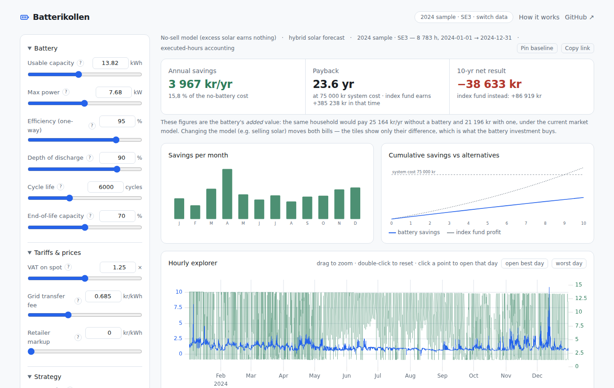

# Batterikollen — Home Battery Profitability Explorer

**Live at [larsenglund.github.io/fabsolarbat](https://larsenglund.github.io/fabsolarbat/)**

Would a home battery pay off for you? Find out with your own hourly consumption, solar and spot-price data — simulated against a mathematically optimal day-ahead charging strategy, not vendor napkin math. Everything runs in your browser; your data never leaves your machine.



## What it does

Each simulated day at 13:00 (when Nord Pool publishes tomorrow's hourly prices) the tool plans the battery's charging and discharging over the next 35 hours with a linear-programming optimizer (HiGHS, compiled to WebAssembly) — charge from solar or cheap grid hours, discharge during expensive ones, respecting power limits, efficiency losses and battery degradation. A full year of real data takes a few seconds, and every parameter change re-simulates automatically.

- **Headline answers:** annual savings, payback time, 10-year net result vs putting the money in an index fund — with honest accounting (every hour counted once, degradation included)
- **Two market models:** excess solar wasted (no export contract) or sold at spot + export bonus. Sweden's abolished 60 öre/kWh skattereduktion is deliberately not included
- **Drill all the way down:** monthly savings, a zoomable full-year hourly explorer, and an hour-by-hour dispatch table for any day
- **Your own data:** upload a merged CSV, a Swedish grid-operator export, or ENTSO-E prices with currency conversion — clear format examples and downloadable templates are shown on the upload page. Data is parsed and stored only in your browser, with a "Remove my data" control
- **Compare & share:** pin any result as a baseline and watch the deltas as you tweak parameters; every scenario is encoded in the URL, so copying the link shares your exact settings (parameters only — never your data)

## FAQ

**Why are these numbers so much lower than vendor calculations?**
Three honest choices: (1) the strategy is *optimal*, so real-world results can only be worse, never better; (2) savings are counted against what you would actually have paid, including the hours the battery does nothing; (3) degradation and efficiency losses are modeled. Also note the original Python analysis this tool grew from accidentally double-counted overlapping planning windows (~2× inflation) — the corrected reference figure is ~3 967 kr/yr for the sample household, not 8 300.

**Why does selling solar make the battery look *less* profitable?**
Because the no-battery baseline improves too. When exports earn money, the battery's solar charging has a real opportunity cost (the sale you gave up), so the battery's *added* value shrinks even though your total bill goes down. The "How it works" page in the app walks through this with numbers.

**Is my data uploaded anywhere?**
No. The site is static; parsing, simulation and storage all happen in your browser (IndexedDB). The "Remove my data" button on the upload page deletes the stored copy.

**Where does the sample data come from?**
A real Swedish household in the SE3 price zone, full-year 2024: hourly consumption, solar production and Nord Pool spot prices. See [`data/`](data/).

## Sample data & fixtures

[`data/`](data/) contains the built-in demo dataset and test fixtures:

- `merged_hourly_data.csv` — canonical merged format: `datetime, excess_solar_kwh, consumption_kwh, price_sek_per_kwh`
- `hourly_production_and_consumption.csv` — raw grid-operator export (Swedish locale, semicolon-separated)
- `hourly_power_price.csv` — raw ENTSO-E day-ahead price export (EUR/MWh)
- `eur_to_sek_2024.csv` — daily EUR→SEK exchange rates
- `annual_battery_results.csv` — golden results from the validated Python LP analysis, used to verify the TypeScript engine

## Project documentation

Built on the analysis work in [`larsenglund/notes/elpris batteri`](https://github.com/larsenglund/notes/tree/main/elpris%20batteri).

| Document | Contents |
|---|---|
| [docs/PLAN.md](docs/PLAN.md) | Product spec, features, milestones, testing & deployment plan |
| [docs/ARCHITECTURE.md](docs/ARCHITECTURE.md) | Tech stack, simulation engine spec, data formats, upload pipeline |
| [docs/DESIGN.md](docs/DESIGN.md) | UI/UX design system |
| [docs/PRIOR_WORK.md](docs/PRIOR_WORK.md) | Research summary of the original Python analysis, incl. the corrections found while porting |

## Development

Requires Node ≥ 22.

```sh
npm install
npm run dev        # dev server
npm run lint       # Biome (format + lint)
npm run test       # Vitest unit tests (incl. golden-file engine validation)
npm run build      # typecheck + production build → dist/
npm run test:e2e   # Playwright smoke + accessibility suite against the production build
```

The engine is validated against frozen results from the original Python analysis (golden-file tests); the e2e suite includes an axe-core accessibility scan of every view in both color themes.

## Deployment

Every merge to `main` runs CI (lint → unit tests → build → e2e) and deploys `dist/` to GitHub Pages via `.github/workflows/ci.yml`.

One-time setup: in the repo settings, set **Settings → Pages → Build and deployment → Source** to **GitHub Actions**. The site then publishes at `https://larsenglund.github.io/fabsolarbat/`.

## Privacy

All computation happens client-side. Uploaded data never leaves the browser. No analytics, no tracking.
